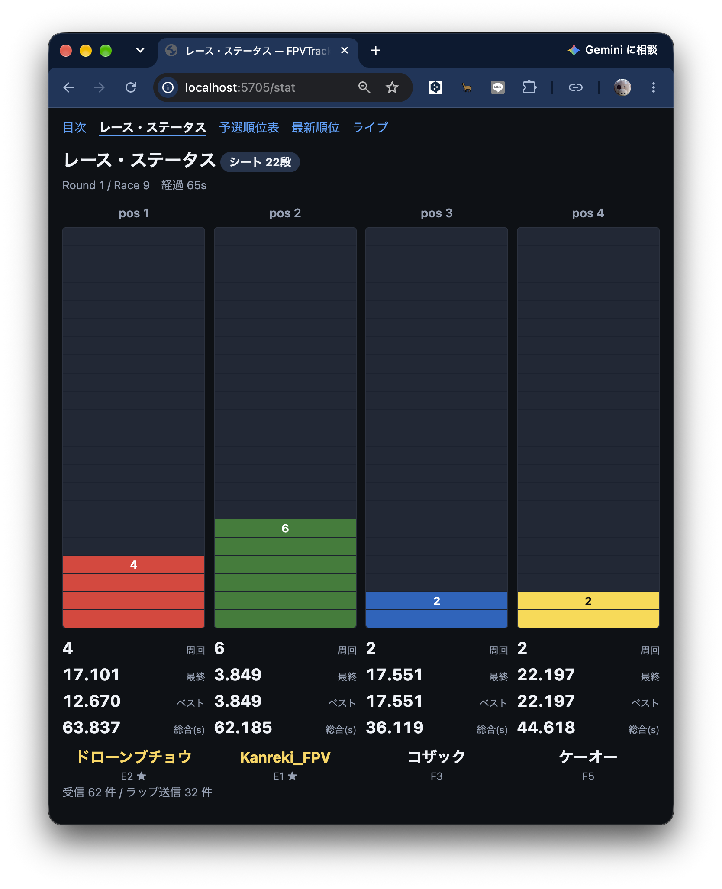
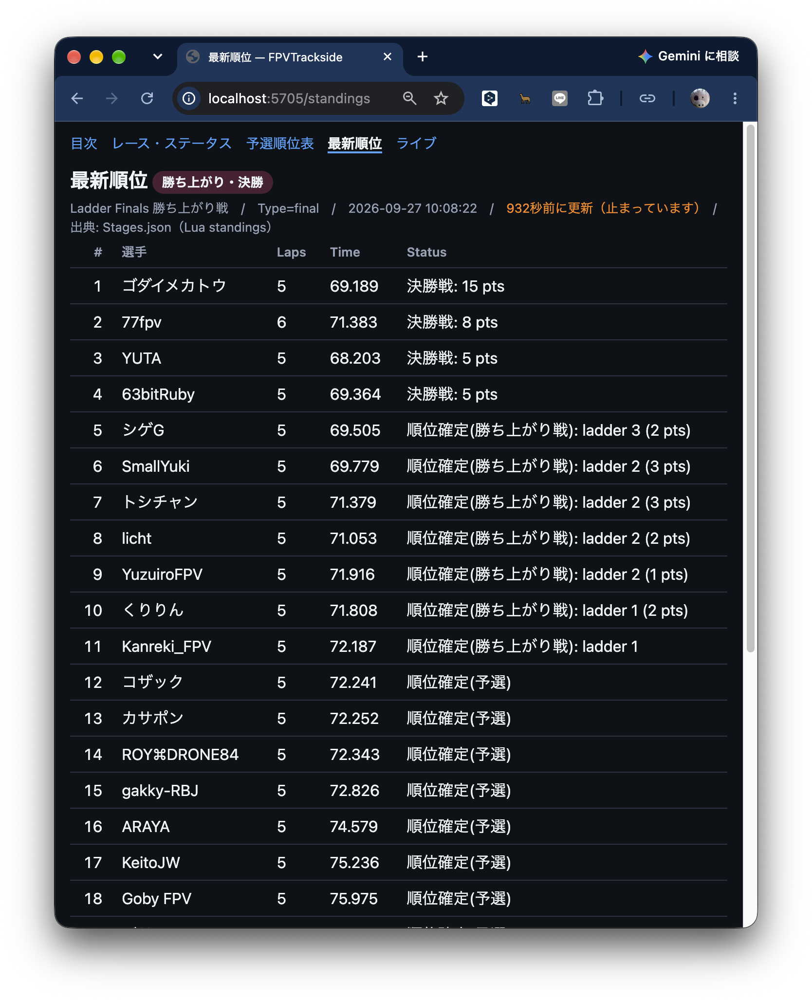

# fpvt2google — FPVTrackside Race Data Relay Program Specification / User Guide

This document describes the specification and operational procedures for `fpvt2google.py`.
It relays race data (laps and standings) from FPVTrackside to external systems such as Google Apps Script.

- Target: `fpvt2google.py` (Python 3 standard library only, single file)
- Test: `test/fpvt2google_test.py`

---

## 1. Overview

### 1.1 Purpose

Relay live race data from FPVTrackside to an external display system in real time.

1. **In-heat lap display** — per-pilot lap count, lap time, and total flight time
2. **Qualification standings** — same content as the app's Standings (retained after qualification ends)
3. **Finals/ladder standings** — same content as the app's Standings (final results)

### 1.2 What it does

- Receives FPVTrackside **Gate / LED POST notifications (ExtensionMode)** via HTTP, formats lap data, and POSTs it to a specified URL
- **Monitors `Stages.json`** in the event folder and POSTs standings when changes are detected
- Displays the same data on a **local web page** (default `:5705`). `/` is a table of contents with 4 sub-pages: race status, qualification standings, latest standings, and live diagnostics (§8)
- **Records and replays** raw events (enabling development and testing without the app)

### 1.3 What it does NOT do (by design)

- **Does not compute standings.** The standings are produced exclusively by the Lua script `ladder_finals.lua`'s `standings()` function; this program simply relays the `Stages.json` file saved by the app
- Does not build display pages (Google Sheets / dashboards are built on the Google side)
- Never writes back to FPVTrackside (read-only and receive-only)

---

## 2. Architecture

```
                     ┌───────────────────────────────────────────┐
                     │            fpvt2google.py                 │
 FPVTrackside        │                                           │
 ┌──────────────┐    │  ①Receive(:8765) ②Format/dedup  ③Send     │   POST   ┌──────────────┐
 │ ExtensionMode├─PUT─►  Instant 200 OK ──► lap-end only ──► queue ─┼────────► │ Lap URL       │
 │ (Gate/LED)   │    │               0.25s batch                  │          └──────────────┘
 └──────────────┘    │                                             │
 ┌──────────────┐    │  ④Monitor Stages.json (debounced)          │   POST   ┌──────────────┐
 │ events/<id>/ ├────►  mtime+size match x2 → Type detection ─────┼────────► │ Standings URL │
 │ Stages.json  │    │                                             │          └──────────────┘
 └──────────────┘    │  ⑤Local display(:5705)  TOC/4 pages + /state │
                     └───────────────────────────────────────────┘
```

### 2.1 Why two data paths are needed

| Path | Reason |
|---|---|
| ExtensionMode (PUT receive) | The **only** way to get in-heat lap data. Each gate pass sends a `DetectionExt` event |
| `Stages.json` monitoring | Standings are computed by Lua scripts. **ExtensionMode's `StageRanking` uses a different calculation** (not from Lua). Since Lua has no file I/O or networking (MoonSharp has no IO registered), reading the app-saved `Stages.json` is the only option |

### 2.2 Thread structure

| Thread | Role |
|---|---|
| Receiver server (`:8765`) | Accepts PUT/POST, returns **200 OK immediately**, queues the body (one thread per request) |
| Lap dispatcher | Takes items from the receive queue, deduplicates within `batch_window_sec` for the **same pilot and same lap only**, dispatches to per-pilot worker queues. `RaceStart` is sent immediately |
| Lap sender worker × `lap_senders` (default 1) | POSTs from assigned queues. **Same pilot always goes to the same worker**, so lap order is preserved. Setting `2+` prevents slow POSTs from blocking other pilots |
| Standings sender | POSTs only when changes are detected. Retries with exponential backoff on failure |
| Stages watcher | Polls mtime/size at configured intervals, reads after two consecutive matching states, and queues the payload |
| Local display (`:5705`) | Serves `/` (TOC), `/stat`, `/qualify`, `/standings`, `/live` (HTML), `/state` (JSON), and `/shared.css` / `/shared.js` |

---

## 3. Requirements

| Item | Requirement |
|---|---|
| Python | 3.8+ (**standard library only**, no pip needed) |
| OS | macOS / Windows (Linux also works) |
| FPVTrackside | Version supporting ExtensionMode (Gate / LED POST notifications). Tested with 2.78.x |
| Network | Receives on localhost (127.0.0.1). **Internet required** for sending to Google via HTTPS |
| Ports | Default 8765 (receive) / 5705 (local display). Does not use FPVTrackside's built-in web server port 8080 |

---

## 4. Setup (First Time)

### 4.1 FPVTrackside Configuration

1. Open **Profile Settings** from the menu
2. Configure **Gate / LED POST notifications**:

   | Setting | Value |
   |---|---|
   | `ExtensionMode` | `true` |
   | `NotificationURL` | `http://127.0.0.1:8765/` |

3. **Restart FPVTrackside** (settings are only read at startup)

> Enabling `ExtensionMode = true` disables the legacy Gate/LED notifications (RemoteNotifier).
> Be aware if you are also using LED strips.

### 4.2 Installing the Relay Program

```bash
# Clone the repository (or just copy tools/fpvt2google.py)
cd FPVTracksideScripts

# Create a config template
python3 tools/fpvt2google.py --init
# → Creates ./fpvt2google.json
```

Edit `fpvt2google.json` (minimum two items):

```json
{
  "google_lap_url":       "https://script.google.com/macros/s/AAAAAAAA/exec",
  "google_standings_url": "https://script.google.com/macros/s/BBBBBBBB/exec",
  "channel_pos": { "E2": 1, "E1": 2, "F3": 3, "F5": 4 }
}
```

> `fpvt2google.json` is `.gitignore`d (contains URLs, so it is not committed).
> On Windows, use `python` or `py -3` instead.

The config file is searched in this order: **current directory → script's directory → script's parent directory** (if in `tools/`, the repository root). You can launch from **any directory** using an absolute path like `python3 /full/path/tools/fpvt2google.py`.
The loaded file path is shown in the startup log as `Config: …`.

### 4.3 Connectivity Test (3 Steps)

```bash
# 1) Start in local-only mode (no POSTing)
python3 tools/fpvt2google.py --local-only

# 2) Start FPVTrackside and run one race
#    → Look for "Hello:", "RaceStart", "[local-only lap] {...}" in the log

# 3) Open the local display in a browser
open http://localhost:5705/
```

If `Hello:` does not appear, see §10 "PUT not received."

---

## 5. Starting and Stopping

```bash
python3 tools/fpvt2google.py                       # Normal start (reads fpvt2google.json)
python3 tools/fpvt2google.py --config /path/cfg.json
python3 tools/fpvt2google.py --local-only          # Log without POSTing to Google
python3 tools/fpvt2google.py --record cap.jsonl    # Record raw events
python3 tools/fpvt2google.py --replay cap.jsonl    # Replay recording (no app needed)
python3 tools/fpvt2google.py --lap-url https://... --standings-url https://...
python3 /full/path/tools/fpvt2google.py            # Launch from any directory
```

- **Config search order**: `--config` → current directory → script's directory → script's parent. Uses the first found; shows `Config: <path>` in the log. If `--config` is specified but the file doesn't exist, exits with error (exit 1)
- **Stop**: `Ctrl-C` in the console
- **Log**: stdout, plus `--log-file relay.log` (or config `log_file`) to also write to a file
- **Daemon** (optional):
  - macOS: `nohup python3 tools/fpvt2google.py --log-file relay.log >/dev/null 2>&1 &` (or launchd / `screen`)
  - Windows: Run in a separate console window, or use Task Scheduler with `pythonw.exe tools\fpvt2google.py` at logon

Startup log example:

```
2026-09-11 14:31:08 Config: /Users/…/FPVTracksideScripts/fpvt2google.json
2026-09-11 14:31:08 channel_pos = {"E2": 1, "E1": 2, "F3": 3, "F5": 4}
2026-09-11 14:31:09 receiver listening on 0.0.0.0:8765
2026-09-11 14:31:09 dashboard listening on 0.0.0.0:5705
2026-09-11 14:31:09 Local display: http://localhost:5705/
```

If `google_lap_url` / `google_standings_url` are not set, a warning is shown at startup and that data type will not be sent (local display still works).

---

## 6. Configuration Reference

`fpvt2google.json` (JSON object). **CLI arguments take priority over config file values.**
Unspecified items use defaults.

### 6.1 Destinations

| Key | Default | Description |
|---|---|---|
| `google_lap_url` | `""` | POST destination for lap data (`RaceStart` / `DetectionExt`) |
| `google_standings_url` | `""` | POST destination for standings |
| `post_timeout_sec` | `10` | Timeout per POST (seconds) |
| `lap_senders` | `1` | Number of parallel lap POST workers. **Default is serial**. Pilots are hashed to workers so lap order per pilot is preserved, but increasing this when Apps Script can't handle concurrent execution (lock waits, 429, timeouts) will **increase failures**. Check Google's execution log before increasing |
| `lap_retries` | `1` | Number of lap POST attempts. Default is no retry (**failed laps are lost**). Set to `2`–`3` for unreliable networks |
| `standings_retries` | `5` | Number of standings POST attempts (backoff: 1, 2, 4, 8 seconds) |

### 6.2 Receiving / Display

| Key | Default | Description |
|---|---|---|
| `listen_host` | `0.0.0.0` | Bind address for the receiver (use `127.0.0.1` if FPVTrackside is on the same machine) |
| `listen_port` | `8765` | Port specified in `NotificationURL` |
| `dashboard_port` | `5705` | Port for the local display page (`0` to disable) |
| `bar_scale` | `"sheet"` | Bar graph vertical axis. `"sheet"` = fixed `bar_rows` rows (reproduces the sheet's `RaceStatus`), `"auto"` = scales to the maximum laps in the current heat |
| `bar_rows` | `22` | Number of rows for `bar_scale: "sheet"` (corresponds to rows 1–22 in the sheet) |

### 6.3 Lap Formatting

| Key | Default | Description |
|---|---|---|
| `channel_pos` | `{"E2":1,"E1":2,"F3":3,"F5":4}` | **Channel → display position `pos`**. Keys can be short names (`"F3"`), raw band names (`"Fatshark3"`), or frequencies (`"5732"`). **Case-insensitive**. If not found, `pos: null` |
| `band_short` | `{}` | Additional band name → short name mapping (merged on top of the built-in `BAND_SHORT`). Example: `{"MyBand": "M"}` |
| `decimal_places` | `2` | Decimal places for seconds. Overridden by `Hello.decimalPlaces` if provided |
| `batch_window_sec` | `0.25` | Deduplication window (seconds) for the **same pilot, same lap** only. Different laps are never dropped. `0` disables batching |

#### Channel Name Translation

FPVTrackside sends `channel.band` with the **long name** (`"Fatshark"`, `"Raceband"`, etc.) — the short name `ShortBand` is not included in the PUT JSON. The program translates using this table:

| Band | Short | Band | Short |
|---|---|---|---|
| `Fatshark` | **F** | `HDZero` | **Z** |
| `Raceband` | **R** | `WalkSnail` | **W** |
| `LowBand` | **L** | `Diatone` | **D** |
| `A` / `B` / `E` | **A / B / E** | `DJIFPVHD` / `DJIO3` / `DJIO4` | **D** |

(Corresponds to the app's `Channels.json` `ShortBand`. Unknown bands use the first letter.)

When looking up `pos`, it checks **short name → raw band name → frequency** in order, so you can use any form in the config:

```json
{ "channel_pos": { "F3": 3, "FATSHARK5": 4, "5658": 1 } }
```

### 6.4 Standings (Stages.json)

| Key | Default | Description |
|---|---|---|
| `events_dir` | `""` | FPVTrackside `events` directory. If empty, uses `Hello.paths.eventsDirectory` → `~/Documents/FPVTrackside/events` |
| `event_id` | `""` | Event ID. If empty, uses the event folder with the **most recently modified `Stages.json`** |
| `script_format` | `"ladder_finals.lua"` | When multiple stages exist, prioritizes the stage using this script |
| `stages_poll_sec` | `1.0` | Poll interval. **Detection requires two consecutive matching states**, so the actual delay can be up to 2x |
| `standings_payload` | `"full"` | `"full"` = `{"Type":..., "stages":[entire Stages.json]}` / `"stage"` = matching stage only / `"standings"` = standings (Headings/Rows) only |
| `send_initial_standings` | `true` | Whether to send the standings read at startup |

### 6.5 Development

| Key | Default | CLI | Description |
|---|---|---|---|
| `local_only` | `false` | `--local-only` | Log without POSTing to Google (counts as successful send). **The old name `dry_run` is also accepted** for backward compatibility |
| `record` | `""` | `--record FILE` | Append received **raw events** as JSONL |
| `replay` | `""` | `--replay FILE` | Replay JSONL through `handle_event` (receiver server still runs) |
| `replay_speed` | `1.0` | `--speed N` | Replay speed. `0` for no wait |
| `log_file` | `""` | `--log-file FILE` | Also write log to file |

### 6.6 CLI Arguments

```
--config PATH        Config file (default: searches fpvt2google.json in
                     current dir → script dir → script parent dir)
--init               Write config template and exit
--lap-url URL        --standings-url URL
--listen-port N      --dashboard-port N
--events-dir PATH    --event-id ID
--channel-pos "E2=1,E1=2,F3=3,F5=4"
--batch-window SEC   --lap-senders N    --local-only
--record FILE        --replay FILE        --speed N
--log-file FILE
```

---

## 7. Data Format Specification

All POSTs use `Content-Type: application/json; charset=utf-8`, with UTF-8 JSON body.
Non-ASCII characters are sent as-is (no `\uXXXX` escaping).
**Every POST body starts with `timestamp` (local time, `yyyy-mm-dd hh:mm:ss`).**

### 7.1 Lap URL

One event per POST. `type` is either `RaceStart` or `DetectionExt`.

#### RaceStart (Heat Start)

```json
{"timestamp":"2026-09-12 10:00:05","type":"RaceStart","round":3,"race":5,"raceType":"Race",
 "actualStart":"2026-09-11T10:00:05.000Z"}
```

| Field | Type | Description |
|---|---|---|
| `timestamp` | string | Data creation time (local time, `yyyy-mm-dd hh:mm:ss`). Always the first key |
| `type` | string | `"RaceStart"` |
| `round` | int | Round number |
| `race` | int | Race number within the round |
| `raceType` | string | `Race` / `TimeTrial` etc. |
| `actualStart` | string\|null | Actual start time (ISO-8601 UTC) |

> **Heat boundary marker.** Reset your lap display when received.
> Pilot list is not included (`RaceLoaded` is not relayed).
> Use `pos` from `channel_pos` for pilot ordering.

#### DetectionExt (Lap Confirmed)

```json
{"timestamp":"2026-09-12 10:00:33","type":"DetectionExt","pos":1,"channel":"F3","pilot":"Shu_FPV",
 "lap":3,"holeshot":false,"total":28.0,"laptime":8.3,"round":3,"race":5,"position":1,
 "finished":false}
```

| Field | Type | Source FPVTrackside Field | Description |
|---|---|---|---|
| `timestamp` | string | — | Data creation time (local time). Always the first key |
| `type` | string | — | `"DetectionExt"` |
| `pos` | int\|null | `channel` → `channel_pos` | Display position (1–4). `null` if not mapped |
| `channel` | string | `channel.band` + `channel.number` | **Translated short name** (`"Fatshark"`+3 → `"F3"`. See §6.3) |
| `pilot` | string | `pilotName` | Pilot name |
| `lap` | int\|null | `lapNumber` | **Completed lap count**. App value used as-is (confirmed: first lap-end = 1). Holeshot pass = 0 |
| `holeshot` | bool | `lapNumber == 0` | `true` if this is the holeshot pass (no lap completed yet) |
| `total` | number\|null | `raceTime` (seconds) | Total flight time since start. Rounded to `decimal_places` |
| `laptime` | number\|null | `lapTimeSoFar` (seconds) | This lap's time. Same rounding |
| `round` | int | `round` | Heat identifier |
| `race` | int | `race` | Heat identifier |
| `position` | int | `position` | FPVTrackside-calculated race position (different from `pos`) |
| `finished` | bool | `raceFinishedForPilot` | `true` if this is the pilot's last detection in this race |

**Sent only when all conditions are met:**

- `isLapEnd == true` — **sector passes are not sent**. With sector configurations (e.g., Aruco 4 markers = 1 prime + 3 splits), up to 4 events per lap would be sent without this filter
- `valid != false` — rejected detections are not sent
- `detectionId` is new — duplicate detection (keeps last 4096 IDs)

**Batching (0.25s window):** Deduplication key is `(round, race, pilot, pos, lap)` — **same pilot, same lap only**.
Within the window, only the latest event for each key is sent. **Different laps are never dropped**, so `lapNumber` will never have gaps.
`RaceStart` bypasses the window and is sent immediately, flushing any pending laps first.

**Parallel sending (`lap_senders`, default `1` = serial):** Workers are assigned by `(round, race, pilot, pos)` — pilot-based — so increasing the count preserves **lap order per pilot**. Different pilots are sent in parallel, preventing one slow Apps Script response from blocking everyone. However, if the Google side can't handle concurrent execution (serialized with `LockService`, slow sheet writes, etc.), **timeouts and 429 errors will increase**, so check the Apps Script execution log before increasing.

### 7.2 Standings URL

Sent only when `Stages.json` changes. One payload per POST.

```json
{"timestamp":"2026-09-12 10:05:12","Type":"final","stages":[ …entire Stages.json… ]}
```

| Field | Type | Description |
|---|---|---|
| `timestamp` | string | Data creation time (local time). Always the first key |
| `Type` | string | `"qualify"` (qualification) / `"final"` (ladder finals) / `"practice"` (official practice) |
| `stages` | array | Full `Stages.json` content (when `standings_payload="full"`) |

`standings_payload` changes the body structure (`timestamp` and `Type` are always first):

| Value | Structure |
|---|---|
| `full` (default) | `{"timestamp":…, "Type":…, "stages":[ … ]}` |
| `stage` | `{"timestamp":…, "Type":…, "stage":{ …matching stage… }}` |
| `standings` | `{"timestamp":…, "Type":…, "name":"Ladder Finals", "standings":{"Headings":[…],"Rows":[…]}}` |

#### Type Detection Rules

Determined from the Lua script `ladder_finals.lua` standings structure:

1. The last column text starts with `practice` (e.g. `practice 1/2`) → `practice` (official practice)
2. `Standings.Headings` has **3+ columns** (`Laps, Time, Status`) → `final`
3. 2 columns (`Laps, Time`) but the last column text contains `ladder` / `final` / `cut` → `final`
4. Otherwise → `qualify`

> The **official-practice card from `ladder_finals.lua` also has three columns**
> (`Laps, Time, Status`), so the Status text is checked before the column count
> to tell it apart from the ladder/final phase (`PRACTICE_ROUNDS`).
> **Changing the standings column layout or the Status wording in `ladder_finals.lua`
> will affect this detection.** Update `classify_standings()` accordingly.

#### Reading the Standings

`stages[].Standings` structure (direct output from Lua `standings()`):

```json
{
  "Headings": ["Laps", "Time", "Status"],
  "Rows": [
    {"Name": "PilotA", "PilotId": "5c8a…", "Values": ["1", "8.644", "final bye"]},
    {"Name": "PilotB", "PilotId": "88ef…", "Values": ["1", "9.880", "out: ladder 4 (26 pts)"]}
  ]
}
```

- **`Rows` order is the ranking** (first = 1st place). Add row numbers for display
- `Values` is a string array matching `Headings` column count. Last column is Status
- Status values (from `ladder_finals.lua`):

  | Status | Meaning |
  |---|---|
  | `final: 28 pts` | Finalist (total points in final) |
  | `final bye` | Qualification 1st/2nd (waiting for final) |
  | `finalist` | Top 2 from the last ladder tier (not yet flown) |
  | `ladder 2: 18 pts` | Flying in tier 2 (undetermined) |
  | `advances: ladder 3` | Advancing to tier 3 (undetermined) |
  | `enters: ladder 2` | Entering at tier 2 (undetermined) |
  | `out: ladder 3 (18 pts)` | Eliminated at tier 3 (rank determined) |
  | `out: ladder 2` | Eliminated without entering tier 2 |
  | `cut` | Cut in qualification |

- Stage selection prioritizes `script_format` (default `ladder_finals.lua`). Falls back to the last stage with standings
- During qualification, `Headings` is `["Laps","Time"]` (2 columns, no Status column)

### 7.3 Google Side (Apps Script) Implementation Notes

- Deploy as a web app with access set to "**Anyone**" (anonymous). POST URL format: `/macros/s/<ID>/exec`
- In `doPost(e)`, **`JSON.parse(e.postData.contents)`** (since we send `Content-Type: application/json`)
- **Keep processing minimal and return immediately**. Apps Script has per-execution time limits, and sheet writes take hundreds of ms. Recommended pattern: receive → save to `CacheService`/`PropertiesService` → serve via separate `doGet`
- **302 redirects**: Apps Script may return 302 for POSTs to `/exec`. This program **re-POSTs the body to the redirect URL**, so no Google-side handling is needed
- **Idempotency**: For latest-state-only displays, use `round`+`race`+`pos` as the overwrite key. For lap history, use `round`+`race`+`pos`+**`lap`** (without `lap`, retries or parallel sends will create duplicate entries). For standings, "replace all with latest" is robust against retries and reordering
- Quotas: Personal accounts have daily execution time limits. With lap-end filtering, **POST count ≈ lap count** (tens per race). `lap_senders` increases concurrency but not total count; longer execution times consume the daily quota faster

Reference (minimal receiver):

```javascript
function doPost(e) {
  const data = JSON.parse(e.postData.contents);
  if (data.type) {                      // Lap data
    CacheService.getScriptCache().put('lap:' + data.round + ':' + data.race + ':' + data.pos,
                                      JSON.stringify(data), 600);
  } else if (data.Type) {               // Standings data
    CacheService.getScriptCache().put('standings', JSON.stringify(data), 600);
  }
  return ContentService.createTextOutput('ok');
}
```

---

## 8. Local Display (`:5705`)

A local fallback for when the internet is down. Displays the same data locally.
**Multiple pages under one URL**, with `/` as the table of contents. Appearance is shared
via `/shared.css` and `/shared.js` (both served from strings embedded in the relay program).

| URL | Content | Refresh |
|---|---|---|
| `http://localhost:5705/` | Table of contents (links to 4 pages + current state summary) | 1s |
| `…/stat` | **Race status** (bar graph). Per-pilot lap count, last/best lap time, total flight time (equivalent to Google Sheet's `RaceStatus`) | 1s |
| `…/qualify` | **Qualification standings**. Freezes the last `Type=qualify` snapshot (unchanged after ladder finals begin; official practice does not overwrite it) | 2s |
| `…/standings` | **Latest standings**. Shows qualification standings during qualifying, automatically switches to ladder/final standings once finals begin | 2s |
| `…/live` | Diagnostics. Received lap list, raw standings values, send statistics | 1s |
| `…/state` | State JSON (usable from custom display pages) | — |
| `http://localhost:8765/healthz` | Receiver health check (`fpvt2google receiver ok`) | — |
| `http://localhost:8765/state` | Same JSON from the receiver side | — |

Since `listen_host` is `0.0.0.0`, **other devices on the same LAN** can view at `http://<host IP>:5705/` (useful for projectors or spectator monitors).

### 8.1 Race Status (`/stat`)

Reproduces the same layout as the Google Sheet's `RaceStatus` (`GAS/raceStat.gs`).

- **One column per `pos`** from `channel_pos`. Column colors match the sheet (pos1 red / pos2 green / pos3 blue / pos4 yellow, pos5+ cycles purple/cyan). Pilots whose `pos` could not be resolved appear as additional columns at the end, so `channel_pos` misconfigurations are not hidden
- Bars **grow upward from the bottom**. `bar_scale: "sheet"` (default) uses a fixed scale of `bar_rows` (default 22) rows, corresponding to rows 1–22 in the sheet. `"auto"` scales to the maximum laps in the current heat
- The topmost cell of each bar shows the lap count (same as the sheet). `holeshot` (lap 0) is not counted as a lap and is shown as `HS`
- Below each bar: **last lap / best lap / total flight time** and **pilot name + channel** (`finished` = ★)
- `RaceStart` clears all columns (same as the sheet)



Best lap is accumulated on the relay side (`best_lap()`). `board` only keeps the latest entry per pilot, so the minimum lap time within the heat is updated each time a new lap arrives.

### 8.2 Qualification Standings (`/qualify`) and Latest Standings (`/standings`)

- `/standings` shows the latest `Stages.json` snapshot as-is (with `Type` badge).
  The badge reads "official practice" during practice, "qualification" during qualifying,
  and it **automatically switches** to ladder/final standings once finals begin
- `/qualify` freezes and shows the **last** `Type=qualify` snapshot
  (equivalent to the sheet's "Qualification Standings"). It is not overwritten by
  finals or official-practice content.
  Stored in memory only — **lost on relay restart** (after restart, `Stages.json` already contains finals data and cannot be restored)
- **Official practice** (`Type=practice`) is the unranked reference card produced by
  `ladder_finals.lua`'s `PRACTICE_ROUNDS`; its Status column reads `practice 1/2`
  (practice rounds flown / total). That card has the same three columns as the ladder
  phase, so **the Status text is checked before the column count** (§7.2).
  On the sheet side, `GAS/raceResult.gs` now writes to the qualification sheet
  **only when `Type=qualify`**, so practice results cannot pollute it
  (changed from `Type != final` on 2026-09-28 — **the Apps Script must be re-pasted**)
- Status column values are translated to Japanese for display (same as `GAS/raceResult.gs`'s `trans()`):
  `practice`→公式練習, `cut`→順位確定(予選), `out`→順位確定(勝ち上がり戦), `advances`→上位へ勝ち上がり,
  `enters`→勝ち上がり戦, `finalist`→決勝戦進出, `final`→決勝戦.
  Translation is **display-only**; `/state` JSON and `/live` show raw values.
  Raw values are preserved in the cell's `title` attribute
- A warning is shown on `/standings` if standings have not updated for 120+ seconds



### `/state` JSON Schema

```json
{
  "now": 1789104619.7,
  "hello": {"fpvtVersion": "2.78.0.894", "platform": "macOS", "eventsDirectory": "/…/events"},
  "heat": {"round": 3, "race": 5, "raceType": "Race",
           "startedAt": "2026-09-11T10:00:05.000Z", "startedMono": 1789104611.3, "elapsed": 8.4},
  "laps": [{"timestamp":"2026-09-12 10:00:33","type":"DetectionExt","pos":1,"channel":"F3",
            "pilot":"Shu_FPV","lap":3,"holeshot":false,"total":28.0,"laptime":8.3,
            "bestlap":7.9,"round":3,"race":5,"position":1,"finished":false,
            "updatedAt":1789104619.1}],
  "standings": {"type":"final","name":"Ladder Finals","timestamp":"2026-09-12 10:01:02",
                "headings":["Laps","Time","Status"],
                "rows":[["PilotA","1","8.644","final bye"]],
                "source":"/…/Stages.json","updatedAt":1789104612.0},
  "qualify": {"type":"qualify","name":"Qualifying","timestamp":"2026-09-12 09:40:11",
              "headings":["Laps","Time"],
              "rows":[["PilotA","10","101.000"]],
              "source":"/…/Stages.json","updatedAt":1789103211.0},
  "stats": {"recv":27,"lap_sent":5,"lap_failed":0,"standings_sent":1,
            "standings_failed":0,"sector_skipped":12,"invalid_skipped":0,"dup_skipped":0},
  "config": {"channel_pos":{"E2":1,"E1":2,"F3":3,"F5":4},
             "bar_scale":"sheet","bar_rows":22,"decimal_places":2,
             "google_lap_url":true,"google_standings_url":true}
}
```

- `laps` are cleared on `RaceStart`, sorted by `pos` (unmapped last, same `pos` sorted by lap count descending).
  `bestlap` is the minimum lap time within the heat (holeshot excluded)
- `standings` is the latest `Stages.json` snapshot, `qualify` is the last `Type=qualify` snapshot
  (§8.2). `name` is the stage name, `timestamp` is the capture time (`yyyy-mm-dd hh:mm:ss`)
- `config.google_*` shows **whether URLs are configured** (boolean, URLs are not exposed).
  `bar_scale` / `bar_rows` / `decimal_places` are for bar graph rendering (§6.2 / §8.1)
- `stats` keys: `recv`=total received events, `lap_sent`/`standings_sent`=successful sends, `*_failed`=failed sends, `sector_skipped`=sector passes, `invalid_skipped`=invalid detections, `dup_skipped`=duplicates

---

## 9. Operational Procedures

### 9.1 Pre-Event Checklist

1. FPVTrackside profile: `ExtensionMode = true`, `NotificationURL = http://127.0.0.1:8765/` (**restart** if changed)
2. `fpvt2google.json`: Both URLs and `channel_pos` match the current channel assignment
3. Start: `python3 tools/fpvt2google.py --log-file relay.log`
4. Log shows `receiver listening on 0.0.0.0:8765` / `dashboard listening`
5. Start FPVTrackside → log shows **`Hello: fpvt … / events=…`** (if not, ExtensionMode is not active)
6. `http://localhost:5705/` opens (TOC → `/stat` race status and `/standings` visible)
7. Run a test race → `RaceStart` and `DetectionExt` appear in the log, `[lap]` send succeeds
8. Standings: `Stages.json changed → Type=qualify` appears

### 9.2 During Event

- Generally hands-off. Monitor:
  - Local display `:5705` `/stat` (race status) and `/standings` (latest standings). Qualification results are preserved on `/qualify`
  - Log for `lap POST failed` / `standings POST failed` (signs of network outage or quota exhaustion)
- **Channel assignment different from expected?** Restart with `--channel-pos "E2=1,E1=2,F3=3,F5=4"` (or leave `pos` as `null` and use `channel` + `pilot` for display)
- If Google side goes down, the relay continues (failures are logged, moves to next)

### 9.3 Post-Event

1. `Ctrl-C` to stop
2. Save `relay.log` and (if recorded) `cap.jsonl`
3. Cross-reference §10 for any issues

---

## 10. Troubleshooting

| Symptom | Cause | Fix |
|---|---|---|
| `Hello:` not appearing | ExtensionMode not set / **not restarted** / wrong URL/port | Check profile settings and restart. `curl http://127.0.0.1:8765/healthz` to verify receiver |
| `Hello` appears but no `DetectionExt` | No race running / no `isLapEnd` (sectors only) | Use `--local-only` and check `sector_skipped` count. If increasing, detections are arriving (check timing config for lap-end) |
| `pos` is `null` | Channel not in `channel_pos` | Check the `"channel"` value in the sent JSON or local display (e.g., `"F3"`) and add to `channel_pos`. Band name translation (§6.3) is built-in, so **use short names in config** |
| `channel` shows `Fatshark3` | Using an old version | Band name shortening is built-in for versions after 2026-09-12. Use `band_short` for unknown bands |
| `lap` is 0 | Holeshot pass (first pass after start) | Normal. `holeshot: true` is set. Display shows `HS` |
| `lap` off by one | Receiver-side correction | This program sends `lapNumber` **as-is** (confirmed 1-based with real data). Do not ±1 on the display side |
| Laps not reaching Google | Wrong URL / deploy access / quota | Check log for `lap POST failed (… tries): HTTPError …`. Use `--local-only` to inspect payloads |
| Google side `lapNumber` has gaps (e.g., 1,2,4,6) | Old version's dedup key was `(round,race,pos)`, dropping different laps when POSTs backed up | Update to version after 2026-09-15 (added `lap` to dedup key). Increase `lap_senders` if delays are large |
| Laps arrive but Google display is slow | Apps Script execution is slow (synchronous sheet writes) | Increase `lap_senders`. On Google side, use "return immediately, display via separate doGet" (§7.3) |
| `lap_senders` increase causes most POSTs to fail | Apps Script can't handle concurrent execution (`LockService` waits, 429, timeout) | Set `lap_senders` back to `1` (serial). Check log for `HTTPError 429` etc. |
| Shutdown warning: `N laps could not be sent` | Laps still in queue at shutdown (slow/failing POSTs) | Increase `lap_senders`, `lap_retries`, or lighten Google-side processing |
| Standings not sent | `Stages.json` not found / `Standings` is empty | Check log for `Stages.json changed`. If absent, use `--events-dir` or `--event-id` explicitly |
| Wrong stage's standings sent | Multiple stages exist | Set `script_format` to the actual script name |
| `Type` is always `qualify` | During qualification (normal) or Lua column layout changed | Check §7.2 detection rules |
| Same standings sent repeatedly | App writes in multiple passes | Already debounced (2x consecutive match). If still frequent, increase `stages_poll_sec` |
| Startup error: `port in use` | 8765/5705 already in use | Change with `--listen-port` / `--dashboard-port`. FPVTrackside's built-in web server uses 8080 |
| Windows: can't access from other machines | Firewall | Allow Python through firewall, or view only from the sending machine |
| Garbled Japanese characters | Receiver encoding issue | Sends UTF-8 (`ensure_ascii=False`). Use `JSON.parse(e.postData.contents)` on Google side |

---

## 11. Testing and Development

### 11.1 Tests

```bash
python3 test/fpvt2google_test.py       # 49 tests (unittest)
```

Tests use a fake Google endpoint (local HTTP server) and a fake event folder, verifying: receive → format → dedup → send / `pos` translation / holeshot lap count / sector, invalid, and duplicate filtering / lap count (1-based, holeshot=0) / **same-pilot different-lap dedup** / **lap ordering preserved with slow Google (serial and parallel)** / `RaceStart` immediate send / Stages.json monitoring and `Type` detection / stage selection / 302 redirect re-POST / 500 retry / local-only / record and replay / config loading and search order (current dir priority, `--config` missing = error, `--init` output location) / **all local display pages and `/shared.css` / `/shared.js` / `/state` delivery** / **best lap accumulation (holeshot excluded)** / board clear on `RaceStart` / **official practice (`practice`) told apart from qualification and finals** / **qualification standings not overwritten by finals** / standings snapshot stage name and timestamp.

Also run the Lua-side tests (`test/ladder_finals_test.lua` etc.).

### 11.2 Record and Replay

```bash
python3 tools/fpvt2google.py --record cap.jsonl --local-only   # Record real events
python3 tools/fpvt2google.py --replay cap.jsonl --speed 0      # Replay (no wait)
python3 tools/fpvt2google.py --replay cap.jsonl --speed 1      # Replay (real-time)
```

- Records **raw received events** (before filtering). Includes `Hello`, so `decimalPlaces` and `primaryTimingSystemLocation` are also reproduced
- Receiver server stays up during replay, so you can mix in live PUTs from another process

### 11.3 Internal Structure (for extending)

| Component | Location |
|---|---|
| Defaults | `DEFAULT_CONFIG` |
| Event formatting | `shape_race_start()` / `shape_detection()` / `channel_key()` |
| Standings formatting | `pick_stage()` / `classify_standings()` / `build_standings_payload()` |
| Local display state | `best_lap()` (accumulated in `_on_detection`) / `_push_stages` (`standings` and frozen `qualify`) / `snapshot()` |
| Local display pages | `SHARED_CSS` / `SHARED_JS` / `page()` / `INDEX_HTML` / `STAT_HTML` / `QUALIFY_HTML` / `STANDINGS_HTML` / `LIVE_HTML` |
| Relay core | `Relay` (`handle_event` / `_on_detection` / `_stages_watcher` / `_lap_sender` (window + dispatch) / `_lap_worker` (parallel POST) / `_standings_sender` / `snapshot`) |
| Dedup / dispatch keys | `_lap_key()` (`round`+`race`+`pos`+**`lap`**) / `_pilot_key()` (pilot-based worker assignment) |
| HTTP | `_ReceiverHandler` (PUT receive) / `_DashboardHandler` (display) / `_RepostRedirect` (302 re-POST) / `post_json()` |
| Startup | `parse_args()` / `build_overrides()` / `load_config()` / `main()` |

**To add a new event type**: Add a branch in `Relay.handle_event()`, create a `shape_*()` function, and call `self.lap_q.put()` (dedup only applies to `type == "DetectionExt"`).

---

## 12. Limitations and Known Caveats

1. **No recovery from missed events.** FPVTrackside does not retry (except `Hello`); failed notifications are silently discarded. This program also has no re-sync mechanism — wait for the next `RaceStart` or standings update to catch up
2. **Pilot identification is by name** (`pilotName`). `DetectionExt` does not include pilot IDs. Cannot distinguish pilots with the same name
3. **Google-side latency is on the order of seconds** (receive → Apps Script execution → display, roughly 2–6 seconds). Not suitable for sub-second live display. Use the `:5705` local display instead
4. **Internet required.** If the venue has no connectivity, Google sends fail (local display continues working)
5. **Standings freshness depends on app writes.** `Stages.json` is updated at race boundaries, so qualification/ladder standings update per-race, not per-lap
6. **`Stages.json` location is heuristic.** Without `event_id`, it picks the most recently modified event folder — could pick wrong if multiple events are open simultaneously
7. No persistent send queue (unprocessed data is lost on shutdown). Laps are deduplicated to the latest by design, so buffering is not intended

---

## 13. Glossary

| Term | Meaning |
|---|---|
| ExtensionMode | FPVTrackside's "Gate / LED POST notifications" new mode. Sends events via HTTP PUT |
| `DetectionExt` | Event for each gate pass. Includes both sector passes and lap confirmations |
| lap-end | `isLapEnd == true` detection = lap confirmed. This is the only type this program sends |
| `pos` | Display position. Derived from channel (band+number) via `channel_pos` (not race position) |
| band / ShortBand | Frequency band. FPVTrackside sends the long name (`Fatshark`) in PUT JSON, not the short name (`F`). This program translates using the §6.3 table |
| `position` | Race position calculated by FPVTrackside |
| Standings | Standings table returned by Lua `standings()`. Saved in `Stages.json` |
| `Type` | Standings phase. `qualify` (qualification) / `final` (ladder finals) / `practice` (official practice) |
| Tier (tie) | A single matchup in the ladder finals. Competed in `LADDER_HEATS` races (terminology from `ladder_finals.lua`) |

---

## 14. References

- Design research and investigation: `REPORTS.md`
- Ladder Finals specification: `ladder_finals.md` / `AGENTS.md`
- FPVTrackside official manual:
  <https://github.com/uewepuep/FPVTracksideCore/blob/master/documentation/FPVTrackside%20Manual.md>
- Extension interface specification (all ExtensionMode events):
  <https://github.com/uewepuep/FPVTracksideCore/blob/master/documentation/POST_Extension_INTERFACE.en.md>
